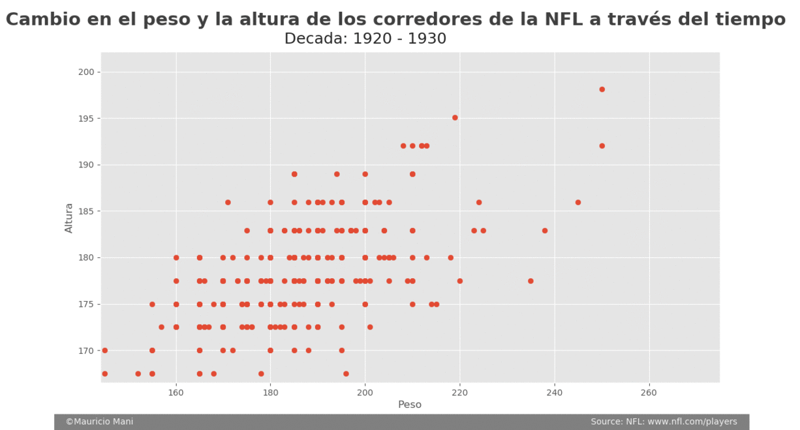
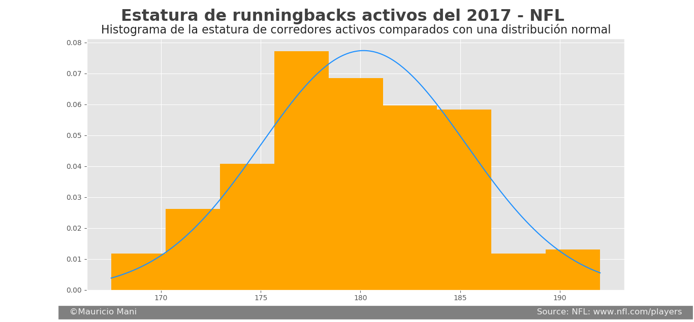
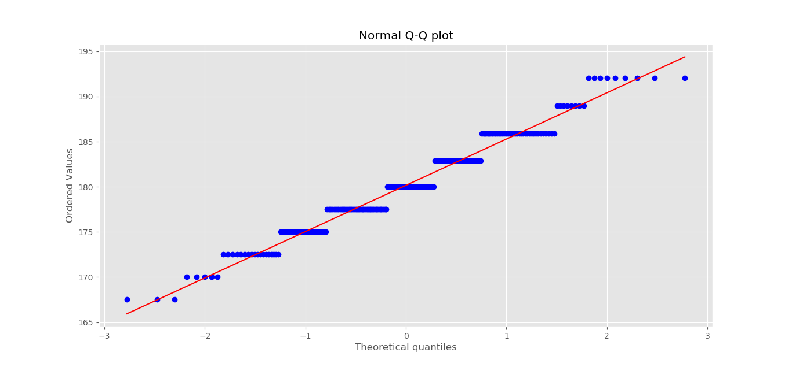
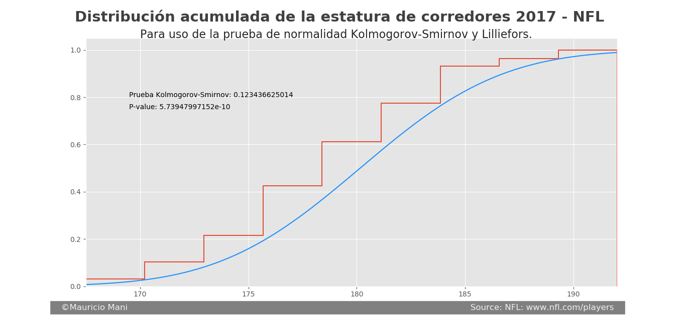
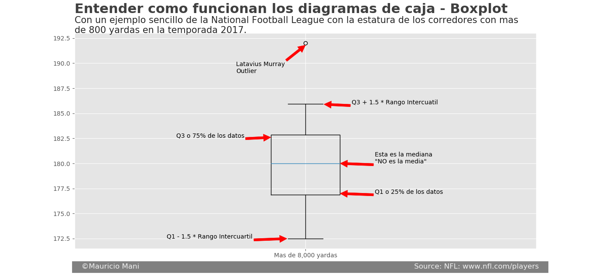
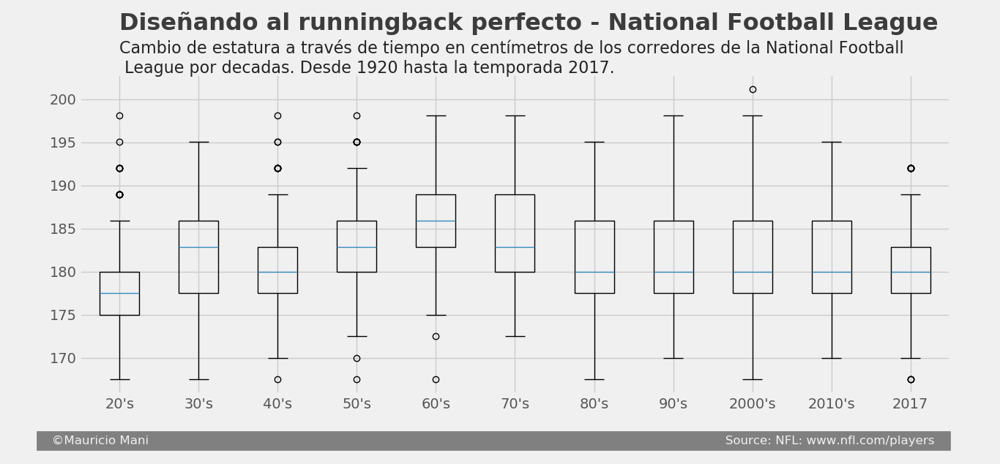
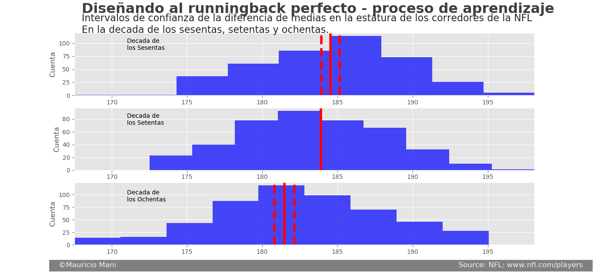
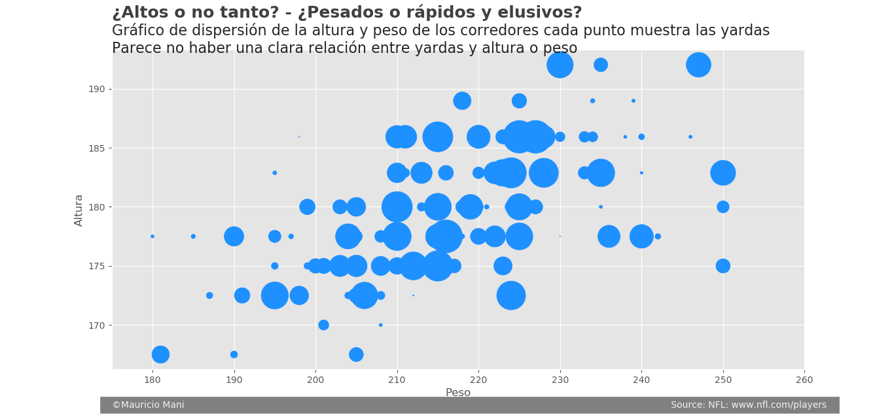

Fun statistics and running backs in the NFL
--------------------------------------------------

#Translations:
* [Español](README.md)
* [English](README-en.md)
There is no translation on plots' title.

## The idea ant the article
In the season of 2013 only two of the top ten best running backs measured more than 6 foot: Adrian Peterson & Arian Foster. 
NFL is characterized for having tall and big players but that is not necessarily true for running backs. 
First: Too tall players are not wanted because they are an easy target behind the line. Shorter running backs can hide behind 
big players, "the line". A low center of gravity is also wanted. 

Has NFL changed since its beginning? Yes and a lot. But, how they have changed? Learning from the past.
the idea of analizing running backs´ database comes from an article wrote by `bleacherreport.com`.
Has NFL learned from the past? Do we have the best possible running backs? BJKissel tried to design  
the best possible running back, based on height, weight and speed. He took as reference 2013 running backs.
For all that, what is history saying?

<br/>
<p align="center">

</p><br/>

## Mean height by decades.
* 1920 - 1930 is: `178.25`
* 1930 - 1940 is: `181.25`
* 1940 - 1950 is: `181.39`
* 1950 - 1960 is: `182.5`
* 1960 - 1970 is: `184.54` 

Gale Sayers (183cm). John David Crow, Paul Hornung (188cm)

* 1970 - 1980 is: `183.92` 

O. J. Simpson (185cm)

* 1980 - 1990 is: `181.48` 

Earl Campbell, Tony Dorsett (180cm)

* 1990 - 2000 is: `181.46` 

Emmitt Smith (175cm). Marshall Faulk, Thurman Thomas (178cm). Terrell Davis, Jerome Bettis (180cm). 

* 2000 - 2010 is: `181.73` 

Warrick Dunn (175cm). Thomas Jones, Ricky Williams, Bryan Westbrook, LaDainian Tomlinson (178cm). Clinton Portis (180cm).

* 2010 - 2016 is: `180.92`
* 2017 is: `180.16`

The image shows how height and weight have changed over decades, since 1920 till 2017 season. 
Over the fiftys and till the seventies height distribution is found on the right and in the later seasons 
it went back to a 181cm mean. 
The horizontal axis shows the weight and the vertical axis shows the height. So an increase in the height would rise observations
and an increase in weight would move observations to the right. It seems running backs are stronger nowadays and smaller
than before the eighties.
In order to understand the learning process over running backs we would make some boxplots. Understanding the is difficult
so we would use a 2017 season example.

## Understanding statistics with 2017 season information. 
Boxplots are one of the most complete tools for beforehand analysis over obtained data. Since unlike boxplots, histograms 
allow us to compare distributions in an easy way. Commonly we want to know how normal is the data. Use a boxplot!
It is easier to see normality graphically with a histogram (do not worry, also with a boxplot). 
First we will graph the height of active running backs in 2017 and we will compare it with a normal distribution.  

<br/>
<p align="center">

</p><br/>

Bottom height is 167.5cm. There are two players with that particular height:
* `Tarik Cohen`: 377 yards
* `Jacquizz Rodgers`: 244 yards

The maximum height is 192cm. There are three players with that height:

* `Derrick Henry`: 744 yards
* `Latavius Murray`: 842 yards
* `Rod Smith`: 232 yards
Mean is 180.16cm, but we can clearly see in the histogram mode is found in other interval.
That is why is common to see smaller running backs than the mean. 
However, It seems normal, right? Well we cannot compared it naked eye. We can use a Q-Q plot. Wich compare values 
seen with hypotetically normal probability value, a normal distribution would be a 45 degrees line. In these case it does not look normal.

<br/>
<p align="center">

</p><br/>

As we can see points are found in certain regions, that is due to a lack of continuity in data. 
That is why Q-Q plot is not a good indicator. 
One of the assumptions of normality is an equal mean, equal median and equal mode. Mean is ´180.21´
the median is ´180.16´ and there is no mode (or all the values are in mode). 
¡Let's do more advanced statistics!
To prove normality in a distribution we can use X^2 test for normality, Kolmogorov-Smirnov test, 
Shapiro-Wilk test and y Lilliefors test the last ones are the most famous for normality. They are all hypothesis testing, where we have a null hypothesis
and an alternative. 

* Kolmogorov-Smirnov test value is: `0.123436625014`
* P-value for the test is: `5.73947997152e-10`
* Shapiro-Wilk test value is: `0.9677223563194275`
* P-value for the test is: `1.819115823309403e-05`

Shapiro Wilk propose a null hypothesis where observations come from a null hypothesis.
We will now see a cummulative distribution of the running backs´ height compared by its normal:

<br/>
<p align="center">

</p><br/>

Normality in our distribution is rejected by the data. So much Lilliefors as Kolmogorov-Smirnov test
are based on the most extreme distance between cummulative distribution seen and hypothetical normal cummulative distribution.
Moreover, the two test we made have extremely low p-values. 
And normality can be crearly seen in a boxplot thanks to boxes dispersion. Extreme values are shown as well.
We will use 2017 season running backs with more than 800 yards.

<br/>
<p align="center">

</p><br/>

```
| Name                 | Height  | Weight| Yards  | 
|----------------------|---------|-------|--------| 
| "Anderson, C.J."     | 172.5   | 224   | 1007.0 | 
| "Lewis, Dion"        | 172.5   | 195   | 896.0  | 
| "Freeman, Devonta"   | 172.5   | 206   | 865.0  | 
| "Ingram, Mark"       | 175.0   | 215   | 1124.0 | 
| "Gore, Frank"        | 175.0   | 212   | 961.0  | 
| "Hunt, Kareem"       | 177.5   | 216   | 1327.0 | 
| "Collins, Alex"      | 177.5   | 210   | 973.0  | 
| "Miller, Lamar"      | 177.5   | 225   | 888.0  | 
| "McCoy, LeSean"      | 180.0   | 210   | 1138.0 | 
| "Lynch, Marshawn"    | 180.0   | 215   | 891.0  | 
| "Crowell, Isaiah"    | 180.0   | 225   | 853.0  | 
| "Howard, Jordan"     | 182.88  | 224   | 1122.0 | 
| "Fournette, Leonard" | 182.88  | 228   | 1040.0 | 
| "Elliott, Ezekiel"   | 182.88  | 228   | 983.0  | 
| "Hyde, Carlos"       | 182.88  | 235   | 938.0  | 
| "Ajayi, Jay"         | 182.88  | 223   | 873.0  | 
| "Gurley, Todd"       | 185.928 | 227   | 1305.0 | 
| "Bell, Le'Veon"      | 185.928 | 225   | 1291.0 | 
| "Gordon, Melvin"     | 185.928 | 215   | 1105.0 | 
| "Murray, Latavius"   | 192.024 | 230   | 842.0  | 
```

## Learning.
>Learning is a state of mental activity that produces modifications or changings in organism's
>cognitive system and its observable behavior. They are relativetilly permanent changes that ocurred by practice conditions.

All right! Now we can understand how running backs´ height have changed over decades and also the learning
(test and error) in order to design the best NFL running back. 

<br/>
<p align="center">

</p><br/>

¿What do we see?
In the twenties the median was low but the distribution has a lot of outliers (possibly the idea around their heads was having higher running backs)
and also it might be low of the average american height.
From thirties to seventies the median height clearly rise. These years are learning years.
Since eighties we see the median has reduced and it has been kept to nowadays.
Decades distribution seems to be positevely biased, you will se a bigger concentration of smaller players. 
Also distributions have shrinkage, it is a sign of knowing, NFL knows what they want.
This is population data, So whatever we have seen on this plots is the reality (unlike using a sample). 
Even though, we will make an hypothesis test on the difference on two independent samples.
(For more information, run the code).

<br/>
<p align="center">

</p><br/>

We can clearly see that it is an improbable event to see those heights by chance. 
Nonetheless, do higher players have a better performance?, Is not it higher players have more yards? Let's see 2017 season.
Just as in the beginning we will use a scatter plot but in this case observations will be in function of season yards.
Clearly we can see there is no relation between yards, height or even weight.

<br/>
<p align="center">

</p><br/>

## Conclusion.
The previous plot shows us that being taller or heavier does not mean to have more yards.
Remember that the mean and the median are central tendency and we have to pick the one that represent the data the best.
In this case mean might not be the best parameter, and remember having a mean does not mean we will not see other values, we can see
very extreme values. 
In fact, we can realize that NFL has learned over the years. And this is shown by the distributions movement over the decades (thus a movement in the mean)
As said in the article, NFL look at having players between 178 and 182 centimeters they are more active. Do not get confused, just because 
a running back is height does not mean his a bad player, probably he is even better. 

## What does the code do?
It first scrape data of historically and 2017 running backs from NFL official web page.
Feet to centimeters are converted.
It plots and make statistical tests, just as you have seen here.
And also some additional information on running backs and full backs.

## References.
* http://bleacherreport.com/articles/1669734-height-weight-and-speed-designing-the-perfect-nfl-running-back
* Romero Medina A. (2017). "Concepto de Apredizaje". Universidad de Murcia.